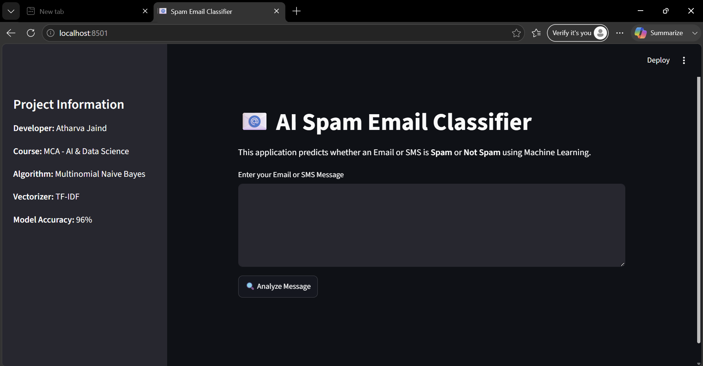
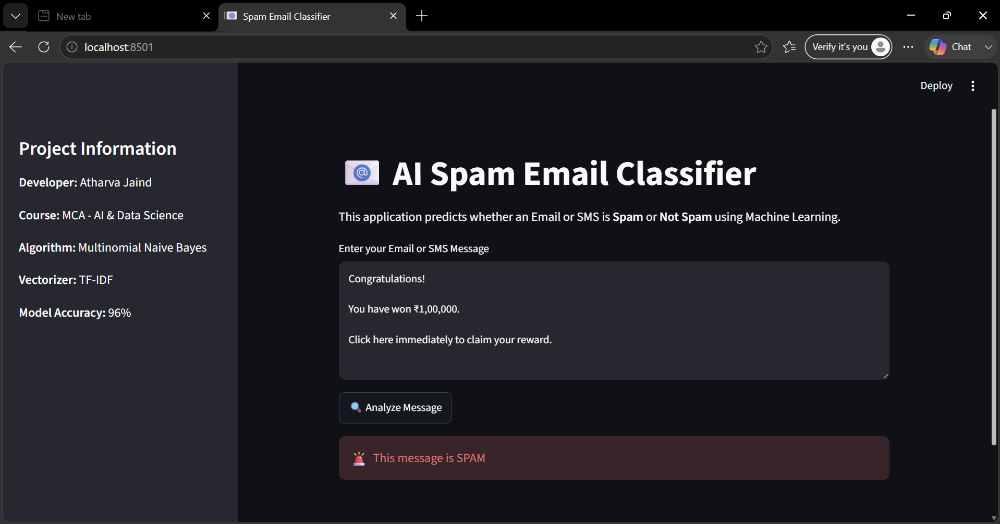
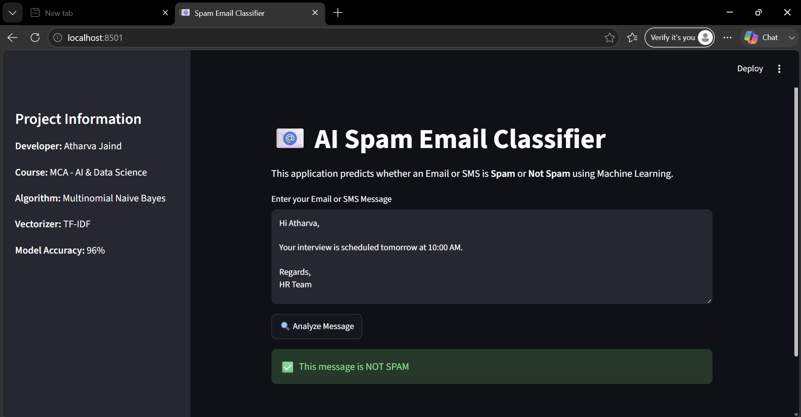

# 📧 AI Spam Email Classifier

A Machine Learning-based web application that classifies Email and SMS messages as **Spam** or **Not Spam** using Natural Language Processing (NLP) techniques.

---

## 🚀 Features

- Detects Spam and Non-Spam messages
- Interactive Streamlit web application
- TF-IDF Vectorization
- Multinomial Naive Bayes Classifier
- 96% Model Accuracy
- Simple and user-friendly interface

---

## 🛠️ Technologies Used

- Python
- Pandas
- Scikit-learn
- Streamlit
- Joblib
- TF-IDF Vectorizer
- Multinomial Naive Bayes

---

## 📂 Project Structure

```
Spam_Email_Classifier
│
├── dataset
│   └── spam.tsv
│
├── models
│   ├── spam_classifier.pkl
│   └── vectorizer.pkl
│
├── screenshots
│   ├── home.png
│   ├── spam_prediction.png
│   └── not_spam_prediction.png
│
├── app.py
├── train_model.py
├── requirements.txt
├── README.md
└── .gitignore
```

---

## ⚙️ Installation

```bash
git clone <repository-link>
cd Spam_Email_Classifier

pip install -r requirements.txt

streamlit run app.py
```

---

## 📊 Machine Learning Workflow

1. Load Dataset
2. Data Preprocessing
3. TF-IDF Feature Extraction
4. Train-Test Split
5. Train Naive Bayes Model
6. Model Evaluation
7. Save Model
8. Build Streamlit Web Application

---

## 📸 Screenshots

### Home Page



---

### Spam Prediction



---

### Not Spam Prediction



---

## 📈 Model Performance

- Accuracy: **96%**
- Algorithm: **Multinomial Naive Bayes**
- Feature Extraction: **TF-IDF**

---

## 👨‍💻 Developer

**Atharva Jaind**

MCA (Artificial Intelligence & Data Science)

Cloud Computing | Machine Learning | AI

---

## 📄 License

This project is created for educational and internship purposes.